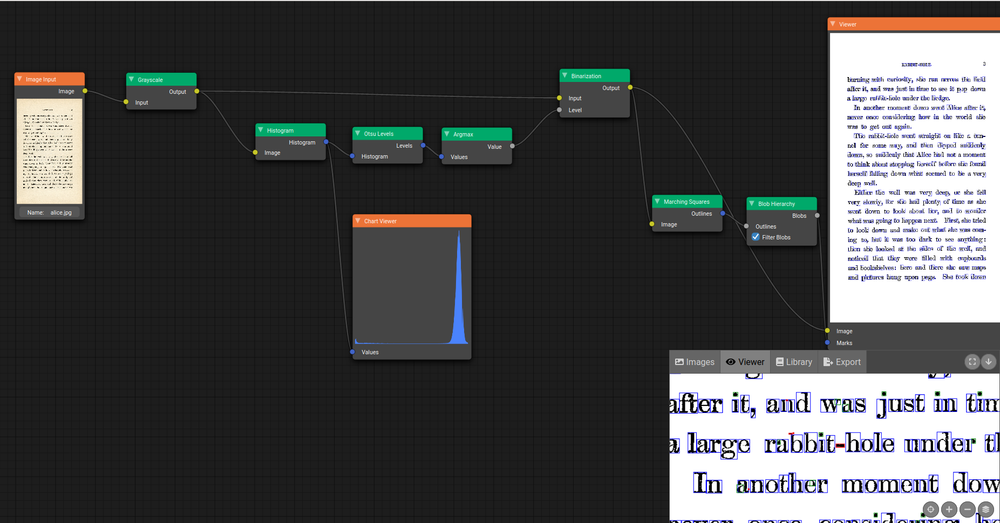

# Pixel Flow Light

Pixel Flow is a node graph driven image processing application,
inspired by [Blender](https://www.blender.org/)'s node editor.

As opposed to the standard version of [Pixel Flow](https://github.com/madbrain/pixel-flow) which use backend computation with GEGL, this version is said to be _light_ as it is a pure frontend application and every computation is made in the browser.

# Screenshot

This example graph implements the firsts steps of an OCR algorithm as implemented
by [Tesseract](https://github.com/tesseract-ocr/tesseract).

# Demo

A live demo is available [here](https://madbrain.github.io/pixel-flow-light/)